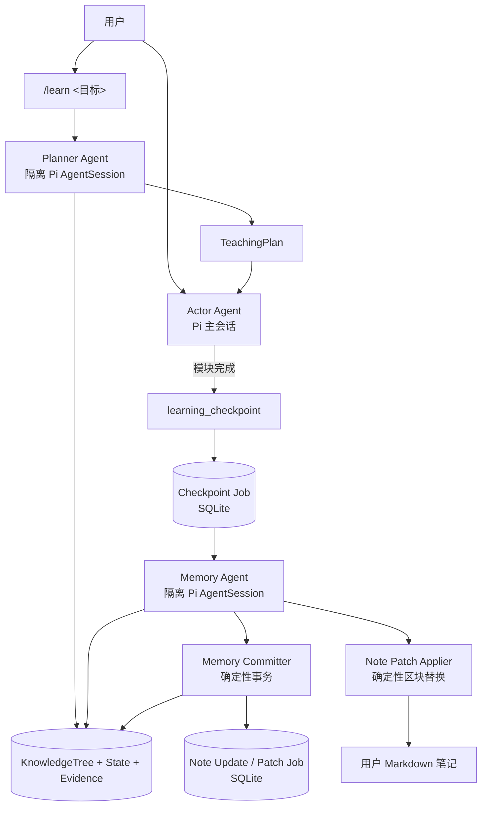
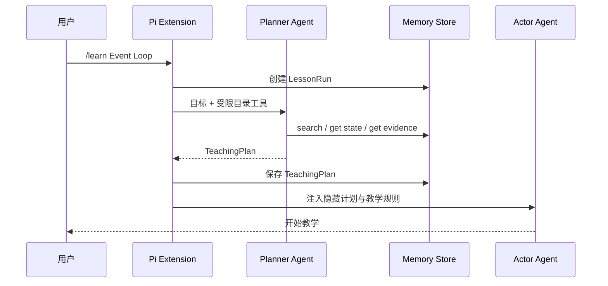
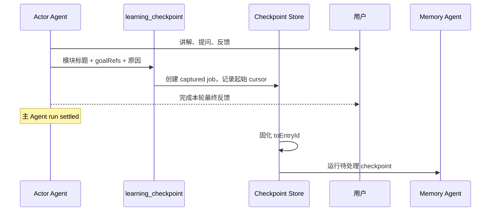
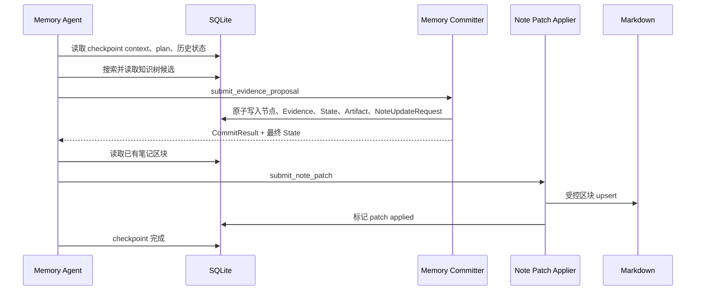
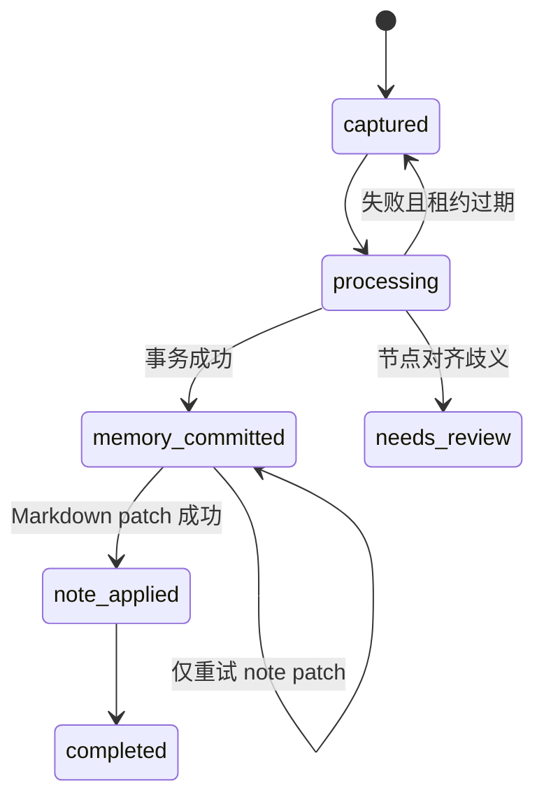

# Byte Mentor Pi 插件 MVP 设计

## 1. 文档状态

- 状态：已确认的 MVP 设计
- 日期：2026-08-14
- 需求来源：[memory-requirements.md](./memory-requirements.md)
- 运行时来源：[DEVELOPMENT.md](./DEVELOPMENT.md)

本文固定 Byte Mentor 以 Pi extension 交付 MVP 时的架构决策。它只定义 MVP 的运行时、数据流和可靠性边界；长期记忆领域模型仍以 `memory-requirements.md` 为准。

核心结论：

> MVP 由 Planner Agent、Actor Agent 和 Memory Agent 组成。Actor 只负责教学和标记教学模块边界；Memory Agent 读取该模块的原始上下文，同时完成证据提取、状态更新和笔记生成；Memory Committer 与 Note Patch Applier 保持为确定性程序边界。

## 2. 目标与范围

MVP 要验证的不是“能否保存聊天记录”，而是如下跨会话闭环：

```text
第一次教学暴露误解
  -> Memory Agent 提取 Evidence 并提交状态
  -> 根据本次教学内容生成复习笔记
  -> 下一次学习时 Planner 命中该状态
  -> Actor 避免重复讲解，并进行针对性复测
```

MVP 包含：

- 懒创建 KnowledgeTree。
- Evidence、UserKnowledgeState 与用户笔记分离。
- 一个显式启动的学习模式。
- Planner、Actor、Memory Agent 三个运行角色。
- 模块级 checkpoint，而不是每条消息级 checkpoint。
- SQLite 中的事务提交、恢复任务和幂等保护。
- 按知识单元区块更新 Markdown。

MVP 不包含：

- 全局知识图谱或知识关系边。
- Embedding 或向量数据库。
- 为每次用户回答启动独立 Observer Agent。
- 让 Actor 直接写 KnowledgeTree、Evidence、State 或 Markdown。
- 整篇重写笔记。
- 根据知识树中缺少节点就判断用户不会。

## 3. 总体架构



### 3.1 角色与写入权限

| 组件 | 运行方式 | 主要职责 | 可直接写入 |
|---|---|---|---|
| Planner Agent | 隔离 Pi AgentSession | 渐进检索记忆并生成 TeachingPlan | 无 |
| Actor Agent | 用户当前 Pi 主会话 | 教学、追问、判断模块边界 | 只能创建 checkpoint job |
| Memory Agent | 隔离 Pi AgentSession | 读取原始上下文、提取 Evidence、生成 NotePatch | 只能调用受控提交工具 |
| Memory Committer | TypeScript 服务 | 对齐、去重、归约、数据库事务 | SQLite 正式记忆 |
| Note Patch Applier | TypeScript 服务 | 校验并替换受控 Markdown 区块 | 指定笔记文件 |

Memory Agent 合并此前独立 Observer 与 Note Writer 的理解工作：它看一次原始教学上下文，同时产出面向 AI 的学习证据和面向用户的笔记内容。它不拥有正式写权限。

## 4. Pi Runtime 设计

### 4.1 Agent Runtime 的使用方式

Actor 使用用户正在交互的 Pi 主 AgentSession。

Planner 与 Memory Agent 各使用一个进程内、隔离的 Pi AgentSession：

```ts
createAgentSession({
  model: activeModel,
  sessionManager: SessionManager.inMemory(cwd),
  customTools: specializedTools,
  tools: specializedTools.map((tool) => tool.name),
  resourceLoader: isolatedLoader,
});
```

隔离 Session 的约束：

- 使用内存 Session，不写入用户的 Pi 会话文件。
- 使用显式工具白名单，只启用该角色需要的自定义工具，不暴露内置文件或 shell 工具。
- `isolatedLoader` 禁用 extension 自动发现，避免子 Agent 再次加载 Byte Mentor 并递归启动。
- 执行结束后释放 Session。
- 如果进程内 SDK 无法共享当前运行时认证，可退回官方 subagent 示例所采用的独立 `pi --mode json --no-session` 进程；该方式不是 MVP 首选。

### 4.2 Extension 命令、事件和工具

| Pi 能力 | 用途 |
|---|---|
| `/learn <目标>` | 创建 lesson run，调用 Planner，启动 Actor 教学模式 |
| `/learn stop` | 结束 lesson run，并强制处理所有未完成 checkpoint / note job |
| `/learn status` | 展示当前计划、未完成 checkpoint 和 dirty note 数量 |
| `session_start` | 打开存储、恢复活动 lesson 与未完成任务 |
| `before_agent_start` | 注入活动 TeachingPlan 和 Actor 教学规则 |
| `context` | 上下文压缩后补充活动计划与待处理模块摘要 |
| `tool_call` | 校验 `learning_checkpoint` 的 lesson、plan 和 goal 引用 |
| `agent_settled` | 固化 checkpoint 消息范围并运行 Memory Agent |
| `session_shutdown` | 保存状态；不保证同步完成，未完成工作留给下次恢复 |
| `resources_discover` | 发布 Actor 使用的 Byte Mentor Skill |

Actor 暴露的写相关工具只有：

```ts
learning_checkpoint({
  moduleTitle: string,
  goalRefs: string[],
  reason: string,
})
```

它不接收 transcript、Evidence、mastery、misconception、节点 ID 或 Markdown 内容。

## 5. 核心数据

`KnowledgeNode`、`LearningEvidence` 和 `UserKnowledgeState` 使用 `memory-requirements.md` 中的定义。本设计新增以下运行时实体。

### 5.1 TeachingPlan

```ts
type TeachingPlan = {
  id: string;
  lessonRunId: string;
  target: KnowledgeCandidate;

  goals: Array<{
    ref: string;
    candidate: KnowledgeCandidate;
    matchedNodeId?: string;
    successCriteria: string[];
  }>;

  prerequisites: Array<{
    goalRef: string;
    userState: "known" | "weak" | "unknown";
    action: "use" | "diagnose" | "offer_remediation";
    reason: string;
  }>;

  approach: string;
  createdAt: string;
};
```

`goalRefs` 为 Actor 的自由教学组织提供稳定引用；它不把教学过程限制为固定步骤或固定模块。

### 5.2 CheckpointJob

```ts
type CheckpointJob = {
  id: string;
  userId: string;
  sessionId: string;
  lessonRunId: string;
  planId: string;

  moduleTitle: string;
  goalRefs: string[];
  reason: string;

  fromEntryId: string;
  toEntryId?: string;

  status:
    | "captured"
    | "processing"
    | "memory_committed"
    | "note_applied"
    | "completed"
    | "needs_review";

  attemptCount: number;
  leaseUntil?: string;
  createdAt: string;
  updatedAt: string;
};
```

`learning_checkpoint` 创建 durable job，而不是让 Actor 直接写正式记忆。当前 Agent run 完成后，`agent_settled` 将 `toEntryId` 固化为该 run 最后一条 assistant 消息，再交给 Memory Agent 处理。这样笔记可以看到 Actor 最终的解释与反馈，而不只看到工具调用之前的消息。

### 5.3 TeachingArtifact

```ts
type TeachingArtifact = {
  checkpointId: string;
  sessionId: string;
  fromEntryId: string;
  toEntryId: string;

  moduleTitle: string;
  goalRefs: string[];
  teachingSummary: string;
  conceptsExplained: string[];
  examplesUsed: string[];
  exercisesUsed: string[];
  canonicalTakeaways: string[];
};
```

TeachingArtifact 记录已经外显并实际执行的教学内容，不记录或要求模型隐藏推理。它解决了“只看 UserKnowledgeState 无法写出有教学上下文的笔记”的问题。

### 5.4 NotePatchJob

```ts
type NotePatchJob = {
  id: string;
  checkpointId: string;
  noteId: string;
  knowledgeUnitId: string;
  sourceStateVersion: number;
  patch: NotePatch;
  status: "pending" | "applied" | "conflict";
  createdAt: string;
  appliedAt?: string;
};
```

在 NotePatch 生成前，Committer 先写入只含 `checkpointId`、目标知识单元和最终状态版本的 `NoteUpdateRequest`。Memory Agent 获取最终 CommitResult 后生成 patch，`submit_note_patch` 再将完整内容持久化为 NotePatchJob。

## 6. 主流程

### 6.1 启动学习



Planner 可以渐进调用 `catalog_listChildren`、`catalog_search`、`catalog_getNode`、`learning_state_get` 和 `learning_evidence_get`。它只能通过 `submit_teaching_plan` 输出计划，不能创建节点或状态。

### 6.2 教学与 checkpoint 捕获

Actor 连续进行多轮教学。只有以下事件应触发 checkpoint：

- 一个知识单元的讲解、练习和反馈已形成完整模块。
- 用户完成一组诊断或练习。
- 即将切换知识点、暂停或结束学习。

不应在 Actor 刚完成一次解释、尚无新的用户表现时触发 checkpoint。

MVP 约束一个主 Agent run 最多创建一个 checkpoint。`learning_checkpoint` 在同一 run 内的第二次调用会被 `tool_call` hook 拒绝，避免两个 job 共享同一个最终 assistant 边界而产生重叠消息范围。



checkpoint 的原始上下文由 Extension 根据 `fromEntryId` 和 `toEntryId` 从 Pi session branch 读取；Actor 不复制或传递消息列表。

### 6.3 Memory Agent 提交状态并写笔记



Memory Agent 使用下列受限工具：

| 工具 | 作用 |
|---|---|
| `checkpoint_context_get` | 读取本 checkpoint 的原始消息范围、TeachingPlan 与元数据 |
| `catalog_listChildren/search/getNode` | 渐进定位知识单元 |
| `learning_state_get` / `learning_evidence_get` | 读取相关历史状态和证据 |
| `submit_evidence_proposal` | 把结构化判断交给 Committer |
| `note_section_get` | 读取既有受控笔记区块和文件元数据 |
| `submit_note_patch` | 提交结构化 Markdown patch 给 Patch Applier |

Memory Agent 先提交 Evidence，再基于 Committer 返回的最终 State 写笔记。这样笔记不会使用未被保守归约确认的“掌握度”。

## 7. Memory Committer

Memory Committer 是正式长期记忆的唯一事务边界。

对 `submit_evidence_proposal` 的一次成功调用，它在同一 SQLite 事务中完成：

1. 校验 checkpoint、goalRef、用户和 lesson run 的归属关系。
2. 对候选知识节点进行精确匹配、规范化关键词匹配和少量候选语义判断。
3. 复用已有节点，或仅在有真实学习证据时懒创建节点及必要祖先 topic。
4. 对无法唯一对齐的候选写入 `needs_review`，不静默创建重复节点。
5. 依据 observation key 幂等追加 LearningEvidence。
6. 根据所有已提交 Evidence 保守归约 UserKnowledgeState。
7. 写入 TeachingArtifact 与 NoteUpdateRequest。
8. 保存 CommitResult，并将 CheckpointJob 推进到 `memory_committed`。

状态归约遵循：

```text
仅自述掌握                 -> unknown / mentioned
教学前无提示答对一次       -> partial
教学后有提示答对           -> partial
多次独立答对               -> unstable 或 stable
延迟复测仍独立答对         -> stable
相同误解再次出现           -> 降级并重新激活误解
```

Memory Agent 可以判断回答的内容、来源和置信度，但不能直接把状态改成 `stable`。

## 8. 笔记更新

### 8.1 Note Writer 的完整输入

Note Writer 的输入不能只有 UserKnowledgeState。它应同时消费：

```text
KnowledgeNode
  + UserKnowledgeState
  + 已提交 LearningEvidence
  + TeachingArtifact
  + checkpoint 原始教学上下文
  + 已有 Markdown 区块
```

对应关系：

| 笔记内容 | 主要来源 |
|---|---|
| 核心理解 | KnowledgeNode、TeachingArtifact、Actor 的已外显讲解 |
| 类比、案例与练习 | TeachingArtifact 和原始上下文 |
| 我的易错点 | 已提交 misconception 与 Evidence |
| 自测题 | learningGoals、exercisesUsed 与最终 State |

用户错误回答不能被写入“核心理解”；它只能在被确认后写入“我的易错点”。

### 8.2 Patch 规则

每个知识单元使用稳定标记：

```markdown
<!-- byte-mentor:unit:js-event-loop:start -->
## Event Loop

### 核心理解

...

### 我的易错点

...

### 自测

...
<!-- byte-mentor:unit:js-event-loop:end -->
```

Patch Applier 只新增或替换标记之间的区块，绝不覆盖区块之外的用户内容。

MVP 对“用户修改 AI 管理区块”的默认策略是：检测区块内容 hash 不一致时将任务标记为 `conflict`，保留文件，不自动覆盖，并在下一次可交互时提示用户处理。

## 9. 幂等、恢复与状态机

合并 Memory Agent 并不会消除幂等需求。一个 checkpoint 会同时产生 SQLite 与 Markdown 两种副作用，且 LLM 调用、Pi runtime 和进程都可能在任何阶段重试或中断。



### 9.1 Checkpoint 幂等

checkpoint identity 使用确定性 key：

```text
sessionId + fromEntryId + toEntryId + planId + moduleTitle + goalRefs
```

相同范围的重复 checkpoint 返回已有 job，不创建新的任务。

### 9.2 Evidence 幂等

每条 Evidence 的 observation key 使用：

```text
checkpointId + goalRef + source + ordinal
```

并设置数据库唯一约束。相同 checkpoint 的重试会返回第一次 CommitResult，不能把同一次用户回答算成多次独立答对。

不同时间、不同消息范围的重复回答仍然应产生新的 Evidence；幂等只去除同一观察范围的重复处理。

### 9.3 NotePatch 幂等

NotePatch identity 使用：

```text
checkpointId + knowledgeUnitId + sourceStateVersion
```

在写文件前先把 patch 内容保存到 SQLite。若 Markdown 写入后进程崩溃、状态尚未标记，重试会使用同一份已保存 patch 进行同一个区块的 upsert，而不是重新调用模型生成不同文本。

### 9.4 恢复策略

| 中断时机 | 恢复结果 |
|---|---|
| Memory Agent 提交前 | job 重回 `captured`，重新分析原始上下文 |
| Evidence / State 已提交，笔记未写 | 返回已有 CommitResult，只重试 NotePatch |
| 笔记已写，状态未标记 | 对相同 patch 再次 upsert 后标记完成 |
| 节点对齐歧义 | `needs_review`，不创建节点、不更新对应状态 |

`session_start` 和 `/learn stop` 都会扫描并恢复非终态任务。

## 10. 存储建议

MVP 使用 SQLite，不需要向量数据库。推荐用户级存储布局：

```text
~/.pi/agent/byte-mentor/
├── memory.sqlite
└── notes/
```

主要表：

```text
knowledge_nodes
user_knowledge_states
learning_evidence
misconceptions
lesson_runs
teaching_plans
checkpoint_jobs
teaching_artifacts
note_update_requests
note_patch_jobs
commit_results
```

SQLite 使用 WAL 模式和短事务；Markdown 写入采用写入临时文件后原子替换。数据库与文件系统不做伪分布式事务，而通过 `note_patch_jobs` outbox 和幂等 upsert 达到可恢复的一致性。

## 11. 建议的代码组织

```text
src/
├── index.ts
├── pi/
│   ├── commands.ts
│   ├── hooks.ts
│   ├── actor-tools.ts
│   └── runtime-factory.ts
├── agents/
│   ├── planner-agent.ts
│   ├── memory-agent.ts
│   └── prompts/
├── domain/
│   ├── types.ts
│   ├── memory-committer.ts
│   ├── state-reducer.ts
│   └── checkpoint-service.ts
├── storage/
│   ├── sqlite.ts
│   ├── catalog.ts
│   ├── checkpoint-store.ts
│   └── note-store.ts
├── notes/
│   └── patch-applier.ts
└── resources/
    └── skills/byte-mentor/SKILL.md
```

## 12. MVP 验收

最小验收场景：

1. 用户第一次学习一个知识点并暴露误解。
2. Actor 在模块结束时创建 checkpoint。
3. Memory Agent 从原始上下文识别该误解，并提交可追溯 Evidence。
4. Committer 创建或复用节点，保守更新 State。
5. Note Writer 生成对应知识单元的核心理解、易错点和自测。
6. 新建 Pi session 后，Planner 命中该历史状态。
7. Actor 不重复讲解已掌握部分，并对历史误解进行复测。
8. 同一 checkpoint 重试不产生重复 Evidence 或笔记区块。
9. 在 Evidence 已提交、笔记未写时中断，重启后能完成笔记更新。

对照实验至少保留三种模式：

```text
off             不使用长期记忆
raw-memory      直接注入原始状态 / 证据
planned-memory  通过 Planner 编译为 TeachingPlan
```

关注历史误解命中率、重复讲解率、针对性诊断率和延迟复测表现。

## 13. 已固定的边界

- Planner 可以读知识树与状态，不能写正式记忆。
- Actor 可以教学和触发 checkpoint，不能判断后直接写状态。
- Memory Agent 可以理解原始教学上下文并提出 Evidence / NotePatch，不能越过 Committer。
- Memory Committer 是知识树、Evidence 和 State 的唯一正式写入者。
- Note Patch Applier 是 Markdown 的唯一写入者。
- checkpoint 是模块级、可恢复的工作任务；正式 commit 由 Memory Agent 处理该任务时发生。
- 笔记更新依赖已提交状态和实际教学上下文，而不是只依赖 UserKnowledgeState。
